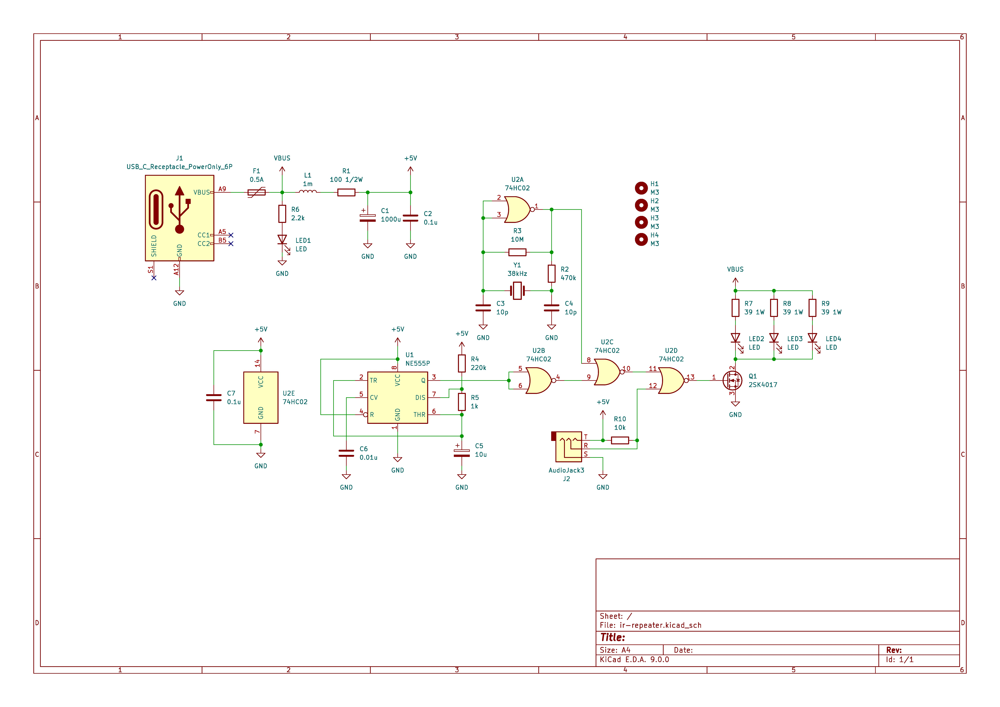
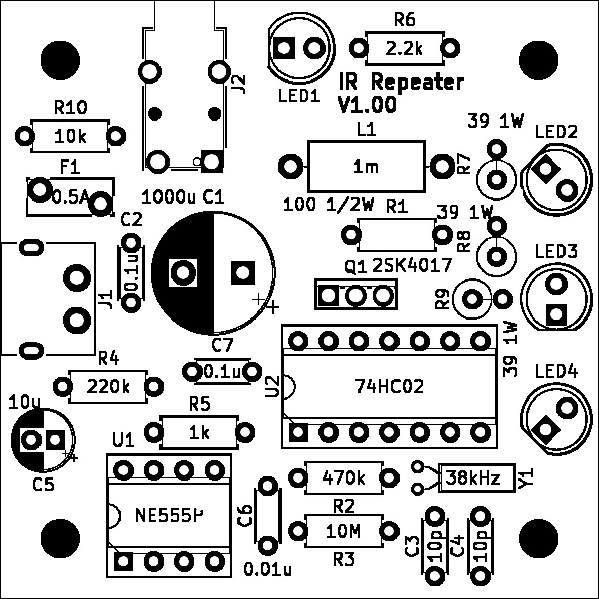
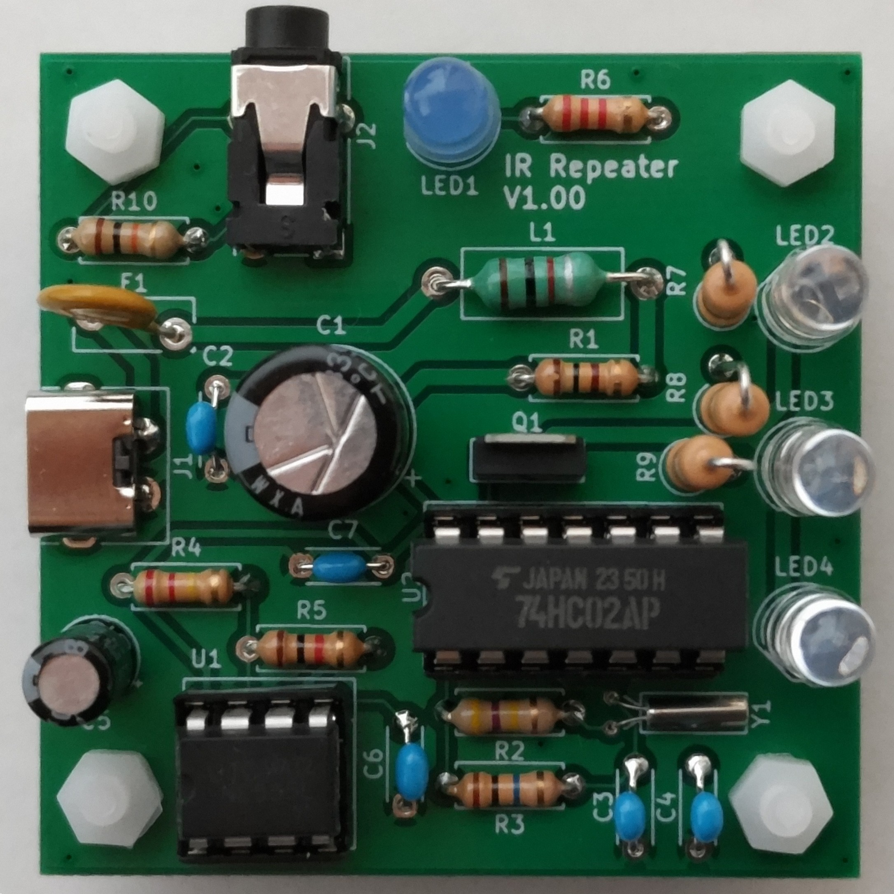

# 赤外線リモコンリピータキット

## 概要
38kHzの赤外線リモコンに対応した赤外線リモコンリピータのキットです。

赤外線リモコンの信号を中継することで信号の届く距離を長くでき、家具の影に隠れた機器のリモコン操作ができるようになります。

赤外線のハウリングキャンセル機能があるため、受光部と発光部が近すぎてハウリングを起こした場合は自動的に送信を停止します。

電源はUSB Type-C端子です。ACアダプタ、ケーブルは付属しておりませんので別途ご用意ください。また、PowerDelivery等の給電には対応しておりませんのでご注意ください。

## 購入
この製品は以下のサイトから購入できます。  

#### 取扱説明書

<table>
  <thead>
    <tr>
      <th>バージョン</th>
      <th>URL</th>
    </tr>
  </thead>
  <tbody>
    <tr>
        <td>最新版</td>
        <td><a href="./manual_8202_20240919.pdf">manual_8202_20240919.pdf</a></td>
    </tr>
  </tbody>
</table>

#### お問い合わせフォーム
[製品に関するお問い合わせ](https://forms.gle/Fn5E3byABXJ8P5sbA)

## 使用方法
ジャックに赤外線センサ（受光部）のケーブルを差し込み、USBコネクタに電源を接続します。

基板本体は赤外線発光部ですので、対象機器の受光部に向けてください。

受光部と発光部が近いと正常に赤外線の信号を中継することができませんので、なるべく受光部と発光部を離してご利用ください。

オーディオジャックを使用しておりますが、オーディオ機器など本製品以外に接続しないでください。機器の故障の原因となります。

## 部品表
<table>
  <tr>
    <th>部品名</th>
    <th>数量</th>
  </tr>
  <tr><td>基板</td><td>1</td></tr>
  <tr><td>タイマーIC NE555L-D08-T</td><td>1</td></tr>
  <tr><td>2入力NORゲート TC74HC02AP</td><td>1</td></tr>
  <tr><td>NchパワーMOSFET 60V5A 2SK4017(Q)</td><td>1</td></tr>
  <tr><td>5mm青色LED 470nm OSB5SA5B64A</td><td>1</td></tr>
  <tr><td>5mm赤外線LED 940nm OSI5FU5111C-40</td><td>3</td></tr>
  <tr><td>USB Type-Cコネクター 電源供給用</td><td>1</td></tr>
  <tr><td>3.5mm小型ステレオミニジャック 基板取付用</td><td>1</td></tr>
  <tr><td>ICソケット (8P)</td><td>1</td></tr>
  <tr><td>ICソケット (14P)</td><td>1</td></tr>
  <tr><td>プラスチックナット+連結(6角ジョイント)スペーサー(10mm)セット</td><td>1</td></tr>
  <tr><td>マイクロインダクター 1mH</td><td>1</td></tr>
  <tr><td>電解コンデンサー 10μF50V105℃ ルビコンPX</td><td>1</td></tr>
  <tr><td>電解コンデンサー 1000μF10V105℃ ルビコンWXA</td><td>1</td></tr>
  <tr><td>積層セラミックコンデンサー 10pF50V C0G 5mm</td><td>2</td></tr>
  <tr><td>積層セラミックコンデンサー 0.01μF50V X7R 5mm</td><td>1</td></tr>
  <tr><td>積層セラミックコンデンサ 0.1u 50V 5mm</td><td>2</td></tr>
  <tr><td>カーボン抵抗(炭素皮膜抵抗) 1W39Ω</td><td>3</td></tr>
  <tr><td>カーボン抵抗(炭素皮膜抵抗) 1/2W100Ω</td><td>1</td></tr>
  <tr><td>カーボン抵抗(炭素皮膜抵抗) 1/4W1kΩ</td><td>1</td></tr>
  <tr><td>カーボン抵抗(炭素皮膜抵抗) 1/4W2.2kΩ</td><td>1</td></tr>
  <tr><td>カーボン抵抗(炭素皮膜抵抗) 1/4W10kΩ</td><td>1</td></tr>
  <tr><td>カーボン抵抗(炭素皮膜抵抗) 1/4W220kΩ</td><td>1</td></tr>
  <tr><td>カーボン抵抗(炭素皮膜抵抗) 1/4W470kΩ</td><td>1</td></tr>
  <tr><td>カーボン抵抗(炭素皮膜抵抗) 1/4W10MΩ</td><td>1</td></tr>
  <tr><td>クリスタル(水晶発振子) 38kHz</td><td>1</td></tr>
  <tr><td>リセッタブルヒューズ 0.5A トリップ電流:1A 耐圧:60V MF-R050</td><td>1</td></tr>
  <tr><td>赤外線リモコン受信モジュール OSRB38C9BX-W150CM</td><td>1</td></tr>
</table>

## 回路図

## 実装図

## 実装例

